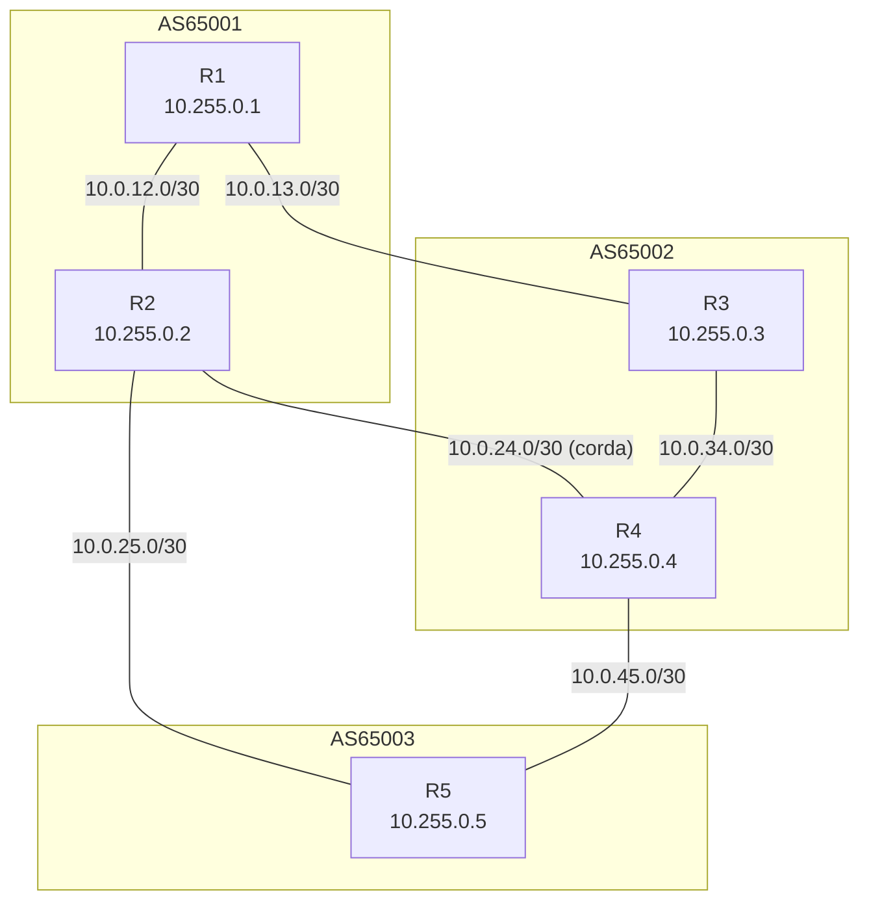
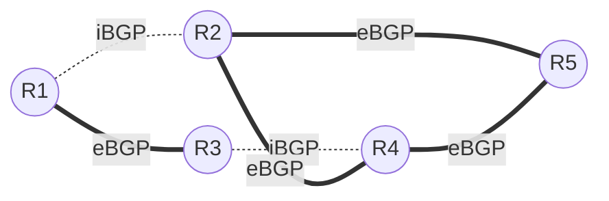
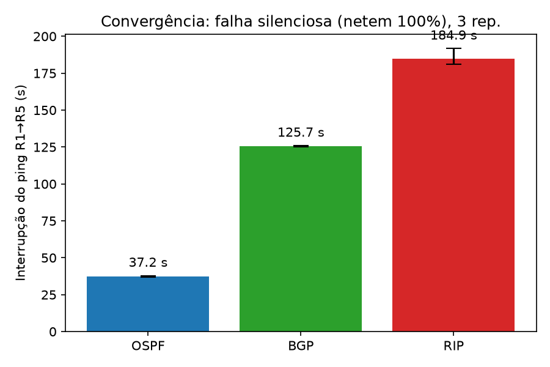
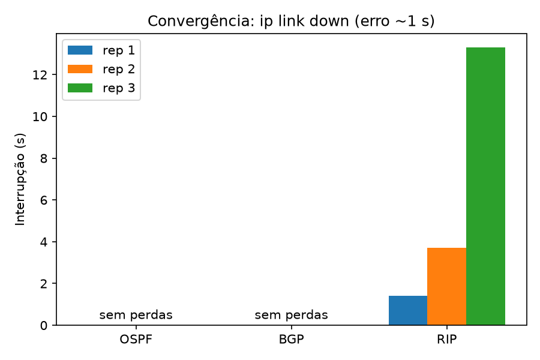
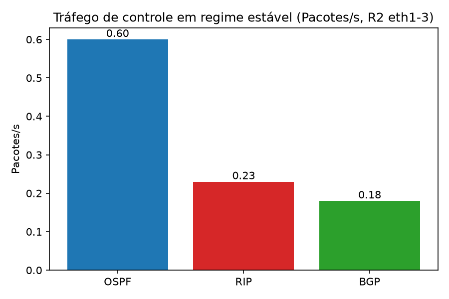
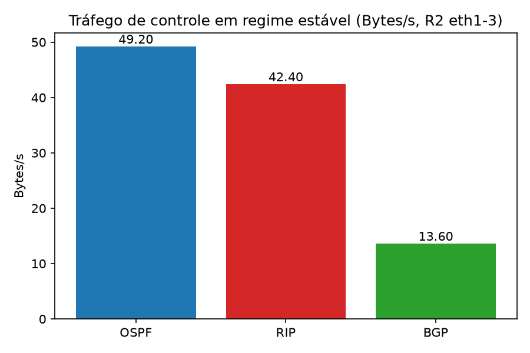
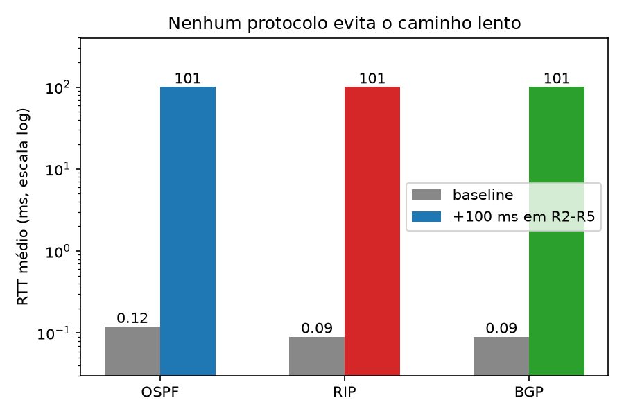
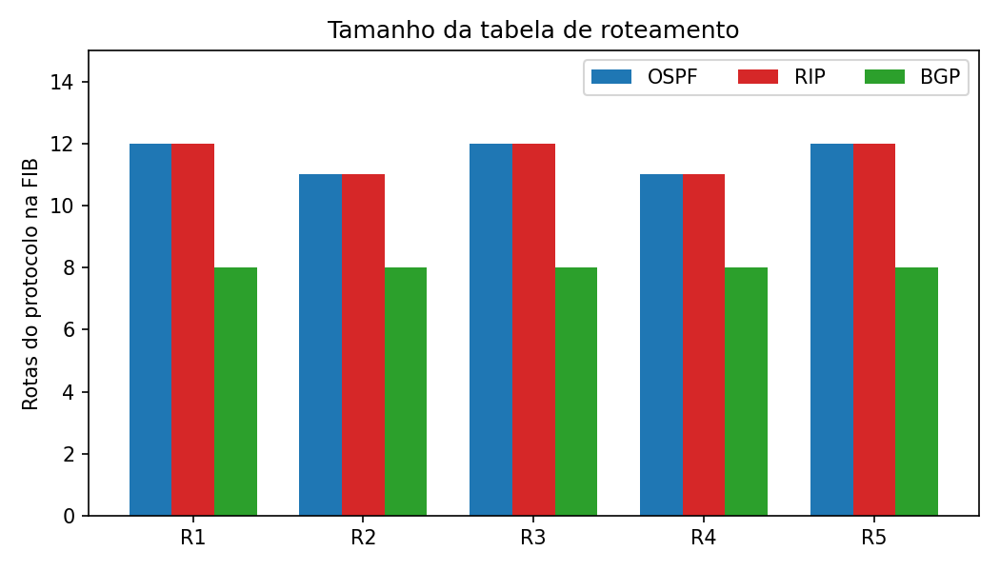
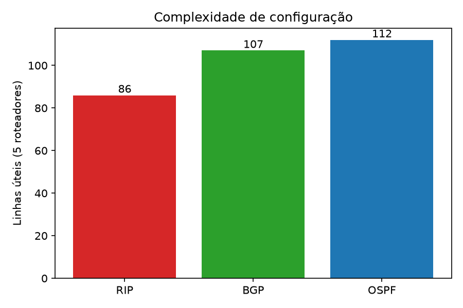

# Roteamento IP com FRRouting: BGP, OSPF e RIP

Trabalho 1 de Redes de Computadores (UNISINOS). Trabalho individual.

Ambiente experimental com 5 roteadores em 3 Sistemas Autônomos, construído com FRRouting em containers (containerlab). Três protocolos (BGP, OSPF, RIP) são configurados sobre a mesma topologia física, um por vez, e comparados em convergência, tráfego de controle, seleção de rotas, tamanho da tabela e complexidade de configuração.

**Vídeo de demonstração:** PREENCHER (link do Release ou do arquivo no repositório)

## Sumário
1. [Ambiente e pré-requisitos](#ambiente-e-pré-requisitos)
2. [Topologia](#topologia)
3. [Como reproduzir](#como-reproduzir)
4. [Premissas de interpretação do enunciado](#premissas-de-interpretação-do-enunciado)
5. [Experimento 1: convergência](#experimento-1-convergência)
6. [Experimento 2: tráfego de controle](#experimento-2-tráfego-de-controle)
7. [Experimento 3: seleção de rotas](#experimento-3-seleção-de-rotas)
8. [Tamanho da tabela de roteamento](#tamanho-da-tabela-de-roteamento)
9. [Complexidade de configuração](#complexidade-de-configuração)
10. [Comparação, escalabilidade e adequação a cenários](#comparação-escalabilidade-e-adequação-a-cenários)
11. [Limitações](#limitações)

## Ambiente e pré-requisitos
- VirtualBox (Windows) com Ubuntu, kernel 7.0.0-29-generic, ~3,3 GiB de RAM
- Docker 29.1.3, containerlab 0.79.0, tcpdump 4.99.6 (no host), python3
- Imagem FRR: `quay.io/frrouting/frr:10.2.1`, digest `sha256:e47e67bd612030cb1bedee2bde85b73913f2ea021573b749deb21d94940f03c1`
- Usuário nos grupos `docker` e `clab_admins`; `sudo` só no `exp2.sh` (tcpdump via `nsenter`)
- Para gerar os gráficos: `matplotlib` (foi executado no Windows)

```
docker pull quay.io/frrouting/frr:10.2.1
```

Escolha da plataforma: o FRRouting é mantido ativamente e suporta os três protocolos. Os exemplos do enunciado (XORP, BIRD, Quagga) foram evitados por orientação do professor, por serem tecnologias antigas.

## Topologia

### Topologia física
5 roteadores, 3 ASes, 6 links. Cada roteador tem um loopback `10.255.0.N/32`, usado como router-id, prefixo anunciado e origem/destino dos testes.



| Link | Rede | Interfaces | Tipo (no BGP) |
|---|---|---|---|
| R1-R2 | 10.0.12.0/30 | R1:eth1 / R2:eth1 | iBGP (AS65001) |
| R1-R3 | 10.0.13.0/30 | R1:eth2 / R3:eth1 | eBGP |
| R2-R4 | 10.0.24.0/30 | R2:eth2 / R4:eth1 | eBGP (corda) |
| R2-R5 | 10.0.25.0/30 | R2:eth3 / R5:eth1 | eBGP |
| R3-R4 | 10.0.34.0/30 | R3:eth2 / R4:eth2 | iBGP (AS65002) |
| R4-R5 | 10.0.45.0/30 | R4:eth3 / R5:eth2 | eBGP |

Regra de endereçamento: o roteador de número menor fica com `.1` e o maior com `.2`. A interface `eth0` de cada container é a rede de gerência do containerlab e não participa do roteamento.

A corda R2-R4 dá dois links eBGP paralelos entre AS65001 e AS65002 e cria caminhos de mesmo custo (ECMP) em OSPF. Cada par de ASes tem pelo menos dois caminhos, e nenhuma falha de um único link isola um roteador.

### Topologia lógica
Linhas grossas são sessões eBGP, tracejadas são sessões iBGP. Em OSPF e RIP, os 5 roteadores formam um único domínio (todos os links acima).



| Protocolo | Domínio | Detalhe |
|---|---|---|
| OSPF | domínio único, área 0 | rede `point-to-point`, custo 10 por link |
| RIP | domínio único, v2 | métrica = saltos, `network 10.0.0.0/16` e `10.255.0.0/24` |
| BGP | AS65001 (R1,R2), AS65002 (R3,R4), AS65003 (R5) | iBGP pelo link direto com `next-hop-self`, sem IGP; anuncia só os loopbacks |

Versão em texto:
```
   AS65001                AS65002
 +----+  10.0.13/30  +----+
 | R1 |--------------| R3 |
 +----+              +----+
   |10.0.12/30          |10.0.34/30
 +----+  10.0.24/30  +----+
 | R2 |--------------| R4 |
 +----+              +----+
   |10.0.25/30          |10.0.45/30
   |        +----+      |
   +--------| R5 |------+
            +----+
            AS65003
```

## Como reproduzir
```
./scripts/up.sh ospf|rip|bgp                 # sobe a topologia com o protocolo escolhido
./scripts/check.sh ospf|rip|bgp              # vizinhos + matriz de ping entre loopbacks
./scripts/down.sh                            # destrói o laboratório
./scripts/demo.sh ospf|rip|bgp               # demonstração passo a passo (usada no vídeo)
./scripts/exp1.sh <proto> down|silent <rep>  # experimento 1: convergência
./scripts/exp2.sh                            # experimento 2: tráfego de controle
./scripts/exp3.sh <proto>                    # experimento 3: seleção de rotas
./scripts/tabela.sh                          # tamanho da tabela de roteamento
./scripts/linhas.sh                          # complexidade de configuração
python3 scripts/graficos.py                  # gera os gráficos em results/graficos/
```

Estrutura:
```
configs/<proto>/rN/{daemons,frr.conf}   configuração de cada roteador, por protocolo
configs/<proto>/vtysh.conf
topo.clab.yml                           topologia física (única)
scripts/                                automação dos experimentos
results/                                CSVs, logs brutos (raw/) e gráficos (graficos/)
```
O `up.sh` copia `configs/<proto>` para `running/` e sobe o laboratório. Só uma pasta de configuração é usada por vez.

## Premissas de interpretação do enunciado
- **Configuração não simultânea:** cada protocolo roda sozinho. O laboratório é destruído e recriado entre eles.
- **Domínio de OSPF e RIP:** os 5 roteadores formam um único domínio, com experimentos separados.
- **BGP:** eBGP entre ASes e iBGP dentro deles, pelo link direto com `next-hop-self`, sem IGP.
- **`no bgp ebgp-requires-policy`:** sem isso, o FRR estabelece a sessão eBGP mas não troca prefixos.
- **Sem políticas de roteamento:** o AS65002 atua como trânsito entre AS65001 e AS65003, o que cria o caminho alternativo AS1-AS3.
- **Timers padrão do FRR:** OSPF hello 10 s / dead 40 s; RIP update 30 s / timeout 180 s; BGP keepalive 60 s / hold 180 s.
- **Custos:** OSPF fixado em 10 por link; RIP usa contagem de saltos.
- **Falhas no BGP** só em links entre ASes (R2-R5): sem IGP, a queda de um link iBGP particiona o AS.
- **BGP anuncia só os loopbacks:** não anuncia as redes dos links `/30`. Isso reduz a tabela do BGP em relação a OSPF e RIP e é consequência desta configuração.
- **Multipath:** nos empates da corda, o OSPF instalou os dois caminhos e o RIP do FRR instalou um só.

## Experimento 1: convergência
Queda do link R2-R5 com ping contínuo de R1 para o loopback de R5 (`10.255.0.5`). Dados em `results/exp1.csv`, logs brutos em `results/raw/`. A sonda amostra ~5 vezes por segundo, e cada ping perdido leva até 1 s: o erro é de ~1 s.

Dois métodos de falha:
- **`link down`** (`ip link set eth3 down`): a interface cai nas duas pontas e os protocolos reagem ao carrier. Mede o melhor caso.
- **Falha silenciosa** (`tc netem loss 100%` nos dois lados do link): o link continua "up" e só os timers do protocolo detectam a falha.

**Hipóteses** (`results/hipoteses.md`, escritas antes da medição): no `link down`, os três recuperam em menos de ~1 s; na falha silenciosa, OSPF ~40 s (dead interval), RIP ≥ 180 s (timeout) e BGP ~180 s (hold time). Só o experimento 1 tem hipótese registrada antes das medições.

| Protocolo | `link down` (3 rep.) | falha silenciosa (3 rep.) |
|---|---|---|
| OSPF | sem perdas | 37,2 s (36,9 a 37,9) |
| BGP | sem perdas | 125,7 s (125,3 a 126,0) |
| RIP | 1,4 / 3,7 / 13,3 s | 184,9 s (181,2 a 191,8) |




**Análise** (rascunho: reescrever com suas palavras)
- Na falha silenciosa, só os timers detectam a falha. O OSPF ficou próximo do dead interval (40 s); o RIP, próximo do timeout de 180 s mais o próximo update.
- O BGP (~125 s) ficou abaixo do hold de 180 s porque o hold conta desde o último keepalive recebido. A baixa variação entre repetições reflete a fase do ciclo de keepalive no instante da injeção, que foi sempre o mesmo. Em outro instante, o valor cairia entre ~120 e 180 s.
- No `link down`, OSPF e BGP reagem ao carrier imediatamente. A hipótese de recuperação abaixo de ~1 s foi **refutada para o RIP** (1,4 a 13,3 s). Explicação provável, não verificada: o RIP depende dos updates periódicos dos vizinhos (30 s, jitter de ±50%) para aprender o caminho alternativo.
- Após a queda, o R1 chega ao R5 por dois caminhos de 3 saltos em OSPF (ECMP da corda) e por um só em RIP.

## Experimento 2: tráfego de controle
Captura com `tcpdump` no host, entrando no namespace do R2 (`nsenter`), nas interfaces `eth1`, `eth2` e `eth3` (a `eth0` de gerência fica fora), por 180 s em regime estável. Filtros: `ip proto 89` (OSPF), `udp port 520` (RIP), `tcp port 179` (BGP). Dados em `results/exp2.csv`.

| Protocolo | Pacotes | Bytes | Pacotes/s | Bytes/s |
|---|---|---|---|---|
| OSPF | 108 | 8856 | 0,60 | 49,2 |
| RIP | 42 | 7632 | 0,23 | 42,4 |
| BGP | 32 | 2454 | 0,18 | 13,6 |




**Análise:** o OSPF tem mais pacotes (Hellos de 10 s em cada link). O RIP tem poucos pacotes, mas grandes, porque cada update carrega a tabela inteira. O BGP tem o menor volume em regime estável (keepalive de 60 s), e sua contagem inclui ACKs de TCP, que OSPF e RIP não têm.

Limitação: mede regime estável, não a fase de convergência inicial; uma janela por protocolo, observada só no R2.

## Experimento 3: seleção de rotas
Rota de R1 para `10.255.0.5`. Duas fases: (a) atraso de 100 ms (`tc netem delay`) no link R2-R5; (b) mudança de política. O `netem` sozinho não muda a rota, porque nenhum dos três protocolos mede latência.

| Protocolo | Baseline | Atraso de 100 ms em R2-R5 | Mudança de política |
|---|---|---|---|
| OSPF | via R2, métrica 20 | rota igual, RTT 0,12 → 100,8 ms | `ip ospf cost 100`: métrica 30, ECMP via R2 e R3 |
| RIP | via R2, métrica 3 | rota igual, RTT 0,09 → 100,7 ms | sem parâmetro de custo por link |
| BGP | via R2 (iBGP, AS-path `65003`) | rota igual, RTT 0,09 → 100,7 ms | `local-preference 200` vinda do R3: rota passa a via R3 (eBGP, AS-path `65002 65003`) |



**Análise:** o caminho de menor custo ou de menor AS-path não é o de menor RTT, e o tráfego continuou pelo caminho lento. No BGP, o AS-path menor decide a favor do R2 antes do critério eBGP > iBGP; o `local-preference` vence o AS-path e muda a rota para um caminho mais longo. O RIP só conta saltos.

Limitação: os tempos de mudança medidos pelo script (OSPF 0,1 s, BGP 0,7 s) estão abaixo da resolução do teste e não são medições de convergência. Uma execução por protocolo, e a política foi aplicada em um único ponto.

## Tamanho da tabela de roteamento
`show ip route summary` em regime estável, contando as rotas aprendidas pelo protocolo na FIB. Dados brutos em `results/tabela.txt`.

| Protocolo | R1 | R2 | R3 | R4 | R5 |
|---|---|---|---|---|---|
| OSPF | 8 | 7 | 8 | 7 | 8 |
| RIP | 8 | 7 | 8 | 7 | 8 |
| BGP | 4 | 4 | 4 | 4 | 4 |



No OSPF, a coluna "Routes" do FRR mostra 11 em todos os roteadores, porque inclui prefixos que também aparecem como conectados; a comparação usa a coluna FIB (7 ou 8). O BGP tem a menor tabela porque só os loopbacks são anunciados nesta configuração, enquanto OSPF e RIP carregam também os 6 prefixos de link.

## Complexidade de configuração
Linhas úteis (sem vazias nem comentários `!`) dos `frr.conf` dos 5 roteadores (`scripts/linhas.sh`).

| Protocolo | Total | R1 | R2 |
|---|---|---|---|
| RIP | 86 | 16 | 19 |
| BGP | 107 | 20 | 20 |
| OSPF | 112 | 20 | 26 |



O OSPF ficou maior por escolha de configuração (`area`, `network point-to-point` e `cost` em cada interface); o RIP anuncia tudo com duas linhas `network`. A contagem de linhas não mede a dificuldade de acertar a configuração: o BGP foi o que mais exigiu conhecimento (`no bgp ebgp-requires-policy`, `next-hop-self`, tipo de vizinho).

## Comparação, escalabilidade e adequação a cenários
Rascunho: reescrever e conferir com a matéria da disciplina.

| | RIP | OSPF | BGP |
|---|---|---|---|
| Princípio | vetor de distância | estado de enlace | vetor de caminhos |
| Seleção de rota | menor número de saltos | menor custo (Dijkstra) | atributos (local-pref, AS-path, eBGP > iBGP) |
| Detecção de falha silenciosa (medido) | ~185 s | ~37 s | ~126 s |
| Tráfego de controle (medido) | updates completos periódicos | Hellos frequentes | keepalives esparsos |
| Configuração (nesta topologia) | mais curta | mais longa | intermediária, mas com mais conceitos |
| Escala | limite de 15 saltos; envia a tabela inteira a cada update | cada roteador guarda o mapa completo (LSDB); áreas permitem escalar | projetado para escala da Internet e para aplicar política entre ASes |
| Cenário adequado | redes pequenas e simples | rede interna de um AS, com convergência rápida | interconexão entre ASes |

- **RIP:** simples, mas com convergência lenta e limite de 15 saltos. Adequado a redes pequenas.
- **OSPF:** convergência rápida e escolha por custo configurável. O custo é a replicação da LSDB, que exige áreas em redes grandes.
- **BGP:** não busca o melhor caminho técnico, e sim o preferido por política. É a única opção entre ASes, e sua escalabilidade vem da agregação e do controle por atributos. Em um AS com mais roteadores, o iBGP exige malha completa ou route reflectors.
- Os três têm objetivos diferentes (BGP: política entre ASes; OSPF e RIP: alcançabilidade interna). A comparação deste trabalho é de comportamento sob as mesmas falhas, não de qual é "melhor".

## Limitações
- Uma repetição por medição nos experimentos 2 e 3; três repetições no experimento 1.
- Erro de ~1 s na sonda do experimento 1.
- Ambiente virtualizado (VirtualBox + containers): os tempos absolutos não representam hardware real.
- Timers padrão do FRR; não foi avaliado o efeito de timers reduzidos.
- Só um ponto de falha (R2-R5) e um ponto de observação (R2) foram usados.
- A hipótese de cada experimento foi registrada antes da medição apenas no experimento 1.